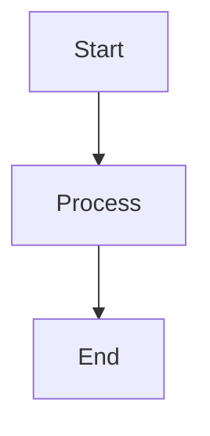

# LiaScript Cheat Sheet (Basic)

## Slides
Slides are separated by `---`.

---

## Speaker Notes
Use a double-braced number to create a speaker note.

{{1}}
This text will appear in the speaker view.

---

## Code Blocks 
Use standard markdown fenced code blocks.

```python
def hello():
  print("Hello, World!")
```

---

## Quizzes 
What is the correct syntax for a slide separator?

    [(X)] `---`
    [( )] `***`
    [( )] `===`

---

## Mermaid Diagrams
You can embed Mermaid diagrams using code blocks:

