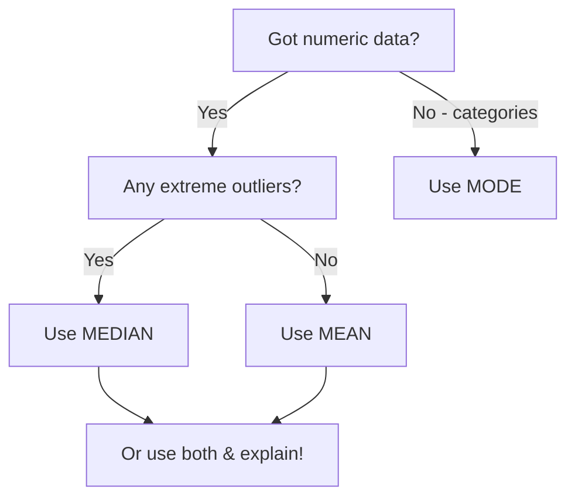
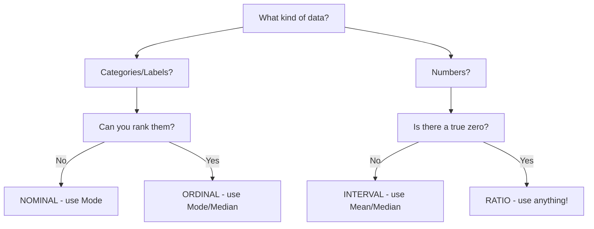

# Making Sense of Data: Central Tendency & Dispersion

Welcome to the world of descriptive statistics! 🎉 Today we're going to become data detectives, learning how to summarize and understand datasets without getting lost in a sea of numbers.

{{1}}
> **Dr. Chen's Promise:** By the end of these 2 hours, you'll be able to look at any dataset and confidently describe what's going on. No PhD in math required—just curiosity and a willingness to have some fun with numbers!

---

## Why Statistics? (And Why You Shouldn't Run Away!)

Let me start with a confession: I once accidentally calculated the mean of people's favorite colors. 🎨

{{1}}
Spoiler alert: The answer was nonsense! That embarrassing moment taught me the most important lesson in statistics: **Not all math is created equal.**

{{2}}
**Think of statistics as your data translator.** You've got this massive pile of information, and statistics helps you turn it into a story people can actually understand.

---

### Descriptive vs. Inferential Statistics

Imagine you're throwing a party and you've ordered pizza 🍕

{{1}}
**Descriptive Statistics** = Looking at the pizzas you have right now
- "We have 4 pepperoni pizzas"
- "The average slice has 8 pieces of pepperoni"
- "Most people grabbed 2 slices"

{{2}}
**Inferential Statistics** = Guessing about future parties
- "If we order 4 pizzas again, everyone will probably be satisfied"
- "People seem to prefer pepperoni over veggie (based on what's left)"

{{3}}
Today we're focusing on **descriptive**—understanding what we can SEE in our data, not predicting the future!

---

### Quick Check! 

What are we doing when we calculate the average grade in THIS class?

    [(X)] Descriptive statistics (describing what happened)
    [( )] Inferential statistics (predicting future grades)
    [( )] Neither—that's just basic math
    
{{1}}
✅ Exactly! We're **describing** the actual grades from actual students. Gold star for you! ⭐

---

## The Big Three: Measures of Central Tendency

Think of these as different ways to answer: **"What's typical here?"**

{{1}}
It's like when someone asks "How's the weather?" You could say:
- "On average, it's 72°F" (Mean)
- "Half the days are warmer than 70°F" (Median)  
- "It's sunny most often" (Mode)

{{2}}
All correct, all useful, all telling slightly different stories!

---

### The Mean: Sharing Pizza Equally

**The Mean** = Add everything up, divide by how many things you have

{{1}}
**Pizza Party Example:** You have 3 friends, and together you have 12 slices total.

12 slices ÷ 4 people = **3 slices per person** (if you share perfectly equally)

{{2}}
```python
# The formula (don't panic!)
Mean = Sum of all values / Number of values

# Or: Mean = Σx / n
# (That Σ is just a fancy "add them all up")
```

{{3}}
**When to use it:** When your data is numeric and doesn't have crazy outliers messing things up.

---

### The Mean in Action

Let's say these are test scores: **70, 75, 80, 85, 90**

{{1}}
Sum = 70 + 75 + 80 + 85 + 90 = **400**  
Count = 5 students  
Mean = 400 ÷ 5 = **80 points**

{{2}}
✨ **Interpretation:** "On average, students scored 80 points on the test."

{{3}}
> **Dr. Chen's Teaching Tip:** Always interpret in context! "80" alone is meaningless. "80 points on the test" tells a story.

---

### When the Mean Lies to You 😱

Here's where things get interesting. Check out these salaries at a small company:

**$30k, $32k, $35k, $33k, $500k** (hello, CEO!)

{{1}}
Mean salary = ($30k + $32k + $35k + $33k + $500k) ÷ 5 = **$126k**

{{2}}
**Does everyone make $126k?** NOPE! Four people are making around $32k while one person is making bank. The mean got "pulled" by that outlier!

{{3}}
This is why we need our second superhero...

---

### The Median: The Middle Child

**The Median** = The middle value when you line everything up in order

{{1}}
Same salary example, lined up:  
**$30k, $32k, $33k, $35k, $500k**

{{2}}
The middle one? **$33k** ← That's your median!

{{3}}
**Much more realistic**, right? Half the employees make less than $33k, half make more. The CEO's salary can't bully this number around!

---

### Finding the Median: The Rules

**If you have an ODD number of values:**  
Just pick the middle one! 

Values: 10, 20, **30**, 40, 50 → Median = **30**

{{1}}
**If you have an EVEN number of values:**  
Take the average of the two middle ones!

Values: 10, 20, **30**, **40**, 50, 60  
Median = (30 + 40) ÷ 2 = **35**

{{2}}
> **Dr. Chen's Memory Trick:** Think "median strip" on a highway—it's right down the middle, splitting traffic in half! 🚗

---

### Quick Practice!

Find the median of these exam scores: **65, 70, 75, 80, 95**

    [( )] 70
    [(X)] 75
    [( )] 77
    [( )] 80

{{1}}
✅ Right! Already in order, odd number (5 values), so pick the middle one: **75**

---

### The Mode: The Popular Kid

**The Mode** = The value that shows up MOST often

{{1}}
Ice cream flavors chosen: **Chocolate, Vanilla, Chocolate, Strawberry, Chocolate, Vanilla, Chocolate**

{{2}}
Mode = **Chocolate** (it appears 4 times—it's winning the popularity contest! 🍫)

{{3}}
**Special cases:**
- **No mode:** All values appear equally (like: 1, 2, 3, 4, 5)
- **Bimodal:** Two values tie for most common (like test scores with peaks at 70 and 90)
- **Multimodal:** Multiple peaks (you've got several popular answers!)

---

### When to Use Mode?

The mode is YOUR FRIEND when dealing with **categories** (nominal data):

{{1}}
- Most common eye color in class
- Most frequent answer on a survey ("Agree")
- Best-selling product
- Favorite pet type

{{2}}
You **cannot** calculate mean or median of "cat, dog, cat, bird, cat"—but you CAN say the mode is "cat"! 🐱

---

### The Showdown: Mean vs. Median vs. Mode



{{1}}
> **Real Talk:** In research, we often report BOTH mean and median to give the full picture. You're allowed to use multiple tools from your statistics toolbox!

---

## Measures of Dispersion: Are We Tight or Scattered?

Okay, so now we know about "typical" values. But that's only half the story!

{{1}}
**Example:** Two classes both have an average score of 75.

- **Class A:** Everyone scored between 72-78
- **Class B:** Half got 50, half got 100

{{2}}
Same mean, TOTALLY different situations! That's where **dispersion** (spread, variability) comes in.

---

### The Range: Simplest Measure

**Range** = Highest value − Lowest value

{{1}}
Test scores: **60, 70, 75, 80, 95**

Range = 95 − 60 = **35 points**

{{2}}
**Translation:** "Scores varied by 35 points from lowest to highest."

{{3}}
**Downside:** ONE extreme score can make the range huge. It's sensitive to outliers (like the mean).

---

### Variance: The Math Gets Real

**Variance** measures how far each data point is from the mean, on average.

{{1}}
**The concept:** 
1. Find how far each value is from the mean
2. Square those differences (to make negatives positive)
3. Average those squared differences

{{2}}
**Formula (don't run away!):**

Variance = Σ(x − mean)² / n

{{3}}
**Example:** Scores = 70, 80, 90 (mean = 80)

- (70−80)² = 100
- (80−80)² = 0  
- (90−80)² = 100

Variance = (100 + 0 + 100) / 3 = **66.67**

{{4}}
**Problem:** What does "66.67" even mean? The units are squared! If we had points, now we have "points²" which is... weird. 🤔

---

### Standard Deviation: Variance's Cooler Sibling

**Standard Deviation** = √Variance

{{1}}
It's literally just taking the square root to get back to our original units!

SD = √66.67 = **8.16 points**

{{2}}
**Now we can say:** "Scores typically deviate from the mean by about 8 points."

{{3}}
**Rule of Thumb (for normal-ish distributions):**
- About 68% of data falls within 1 SD of the mean
- About 95% falls within 2 SDs
- About 99.7% falls within 3 SDs

{{4}}
> **Dr. Chen's Analogy:** If the mean is your home base, the SD tells you how far people typically wander from home. Small SD = everyone stays close. Large SD = people are all over the map!

---

### Visualizing Standard Deviation

Imagine two dartboards 🎯:

{{1}}
**Small SD:** All darts clustered tightly around the bullseye (mean)

```
    ●●●
   ●●●●●
    ●●●
```

{{2}}
**Large SD:** Darts scattered all over the board

```
●       ●
  ●   ●
    ●       ●
  ●   ●
●       ●
```

{{3}}
Both might have the same average distance from center, but they tell VERY different stories about consistency!

---

## Data Types: The Secret to Choosing the Right Tool

Not all data is created equal! Understanding your data type is like knowing which gear to use on a bike 🚴

{{1}}
**The Four Levels:**
1. **Nominal** - Categories with no order
2. **Ordinal** - Categories WITH order  
3. **Interval** - Numeric with no true zero
4. **Ratio** - Numeric with true zero

---

### Nominal: Just Names

**Categories with NO inherent order**

{{1}}
Examples:
- Eye color (blue, brown, green)
- Country of origin
- Type of pet
- Favorite ice cream flavor

{{2}}
**What you CAN do:**
- Count frequencies: "15 people have brown eyes"
- Find the mode: "Brown is most common"

{{3}}
**What you CANNOT do:**
- Calculate mean or median (average of "cat, dog, cat"? Nope!)
- Say one is "more" than another

---

### Ordinal: There's an Order!

**Categories that CAN be ranked, but distances between ranks aren't equal**

{{1}}
Examples:
- Survey responses: Strongly Disagree, Disagree, Neutral, Agree, Strongly Agree
- Education level: High School, Bachelor's, Master's, PhD
- Race finish: 1st place, 2nd place, 3rd place

{{2}}
**What you CAN do:**
- Find the mode: "Most people Agreed"
- Find the median: "The middle response was Neutral"
- Say "This is higher/lower than that"

{{3}}
**What's tricky:**
The distance between "Disagree" and "Neutral" might not be the same as between "Neutral" and "Agree"!

---

### Interval: Numeric but No True Zero

**Numbers where differences matter, but there's no absolute zero**

{{1}}
Examples:
- Temperature in Celsius/Fahrenheit (0° doesn't mean "no temperature exists")
- Years (Year 0 is arbitrary)
- IQ scores

{{2}}
**What you CAN do:**
- Calculate mean: "Average temperature was 72°F"
- Calculate median and mode
- Say "today is 10° warmer than yesterday"

{{3}}
**What you CANNOT do:**
- Say "80°F is twice as hot as 40°F" (because 0° doesn't mean "no heat")

---

### Ratio: The Full Package!

**Numbers with equal intervals AND a true zero**

{{1}}
Examples:
- Height, weight, age
- Income, price
- Number of children
- Test scores (if 0 = got nothing right)

{{2}}
**What you CAN do:**
- EVERYTHING! Mean, median, mode, SD, range
- Make ratio statements: "Person A is twice as tall as Person B"

{{3}}
**The golden rule:** If zero means "none exists," it's ratio data!

---

### The Decision Tree 🌳



---

### Quick Quiz Time! 🎯

What type of data is "Number of siblings"?

    [( )] Nominal
    [( )] Ordinal
    [( )] Interval
    [(X)] Ratio

{{1}}
✅ Correct! It's ratio because:
- It's numeric
- Zero means "no siblings" (true zero)
- You can say "twice as many siblings"

---

### Another One!

What type of data is "Satisfaction rating: Very Unsatisfied, Unsatisfied, Neutral, Satisfied, Very Satisfied"?

    [( )] Nominal
    [(X)] Ordinal
    [( )] Interval
    [( )] Ratio

{{1}}
✅ Yes! It's ordinal because:
- Categories can be ranked (Very Unsatisfied < Unsatisfied < etc.)
- But the "distance" between categories isn't precisely equal
- Best statistics: Mode and Median

---

## Putting It All Together 🎉

Let me show you how this works in real research:

{{1}}
**Scenario:** You surveyed 100 students about study habits.

**Variables:**
- Hours studied per week (ratio) → Use mean & SD
- Stress level (1-10 scale) (ordinal*) → Use median or mean carefully
- Major (nominal) → Use mode
- GPA (ratio) → Use mean & SD

{{2}}
*Some researchers treat Likert scales as interval/ratio if there are many points—it's debated!

---

### Your Statistical Toolbox 🧰

> **Remember:** Different questions need different tools!

{{1}}
- **"What's typical?"** → Mean (if no outliers), Median (if outliers/ordinal), Mode (if categorical)
- **"How spread out?"** → Range (quick look), SD (precise measure)
- **"What kind of data?"** → Check nominal/ordinal/interval/ratio FIRST!

{{2}}
**Dr. Chen's Final Wisdom:** There's rarely ONE right answer. Be a thoughtful researcher—choose the statistic that best tells your data's story, and always explain WHY you chose it!

---

## Wrap-Up & What's Next 🚀

**What we covered today:**
✅ Descriptive vs. inferential stats  
✅ Mean, median, mode (and when to use each)  
✅ Range, variance, standard deviation  
✅ The four data types and appropriate statistics

{{1}}
**Coming up in our Exercise Session:**
- You'll actually CALCULATE these stats with real data
- Create visualizations (histograms & box plots) 
- See patterns and outliers with your own eyes
- Practice choosing the right statistic for different scenarios

{{2}}
**Homework thought:** Start noticing statistics in the wild! News articles, research papers, social media. Ask yourself: "Did they use the right measure? Are they telling the full story?"

{{3}}
See you in the exercise session—bring your curiosity and your calculator! 📊✨

---

## References & Resources

**Textbooks:**
- Agresti, A., & Finlay, B. (2014). *Statistical Methods for the Social Sciences* (4th ed.). Pearson.
- Field, A. (2018). *Discovering Statistics Using IBM SPSS Statistics* (5th ed.). SAGE Publications.

**Online Tools:**
- Seeing Theory (interactive visualizations): https://seeing-theory.brown.edu/
- Khan Academy Statistics: Free video tutorials

**Quick Reference:**
- Formulas cheat sheet (provided in course materials)
- Decision flowchart for choosing statistics (see slide 31)

{{1}}
> Questions? Confusions? Aha moments? I'm here for all of it! Statistics is a journey, not a destination. You're doing great! 🌟
